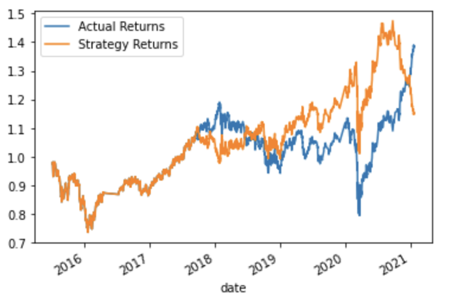

# Machine Learning Trading Bot
### The following project consists of a financial analysis using machine learning.

## Instructions:

This section divides the steps for this Project, as follows:
* Step 1: Establish a baseline performance 
* Step 2: Tune the baseline trading algorithm
* Step 3: Evaluate new machine learning classifier

# Packages and Requirements
In order to run the code make sure you are in the `dev` environment. To create a `dev` enviroment that runs python 3.7, go to your terminal and:
`conda create -n dev python=3.7 anaconda`
Once the enviroment is created just go to your terminal and type `conda activate dev` and to deactivate enviroment, `conda deactivate dev`.
If you have any running the code, please go to the `requirements.txt` file and make sure to install the require packages and libraries as follow;

# Outline
- [Part 1: Establish a Baseline Performance](#part-1-establish-a-baseline-performance)
- [Part 2: Tune the Baseline Trading Algorithm](#part-2-tune-the-baseline-trading-algorithm)
- [Part 3: Conclusion](#part-4-conclusion)

# Part 1: Establish a Baseline Performance
On the first part of my analysis process I loaded a csv file into my jupyter notebook, so that I could analyse information such as date,open,high,low,close and volume of the asset.

I, then cleaned some data by dropning null values and based on the "close" prices I created a new column that cointain the percent change of the actual returns.

Once the data was clean I progresss to use the machine learning model - `SKLearn - SVM`. I then use the svc classifier model to fit the training data and to make predictions. I reviewed the classification model associated with the svc model predictions.

The next step was to create a column where I can add my prediction values, so that I could compare to the actual returns. As we can see in the following image;

# Part 2: Tune the Baseline Trading Algorithm
This part of the project is when I tuned the model in order to compare the model and then to decide which model would be the best to use.

I imported the model `SKLearn - LogisticRegression`. Which then I folllowed the same path from above, but now I used the original data as baseline mode to fit my new classifier. The following shows the model's performance;

The next step was to create a column where I can add my prediction values, so that I could compare to the actual returns. As we can see in the following image;

# Part 3: Conclusion

After comparing the both models, we can confirm that the `SKLearn - SVM` performed better for such occasion rather than `SKLearn - LogisticRegression`. A clear picture was when we analyse the plots for each model and we can see the disparity od results when looking at the `SKLearn - LogisticRegression` plot  (the second plot).

 